# Лабораторно-практична робота №5

### «Розширення бекенд-додатку власними сутностями та реалізація REST API»

---

## Реалізовані сутності та їх зв’язки

### Діаграма інформаційної системи

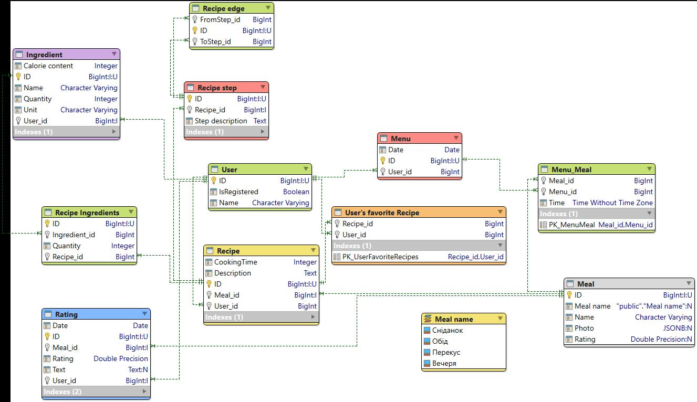

### Опис

- **Meal** — містить інформацію про страви
- **AppUser** — містить інформацію про користувачів
- **Recipe** — містить інформацію про рецепти
- Також реалізовано усі інші сутності з діаграми

## Реалізовані API ендпоінти

### Meal

- `POST /v1/meals` — створення запису
- `GET /v1/meals` — отримання всіх записів
- `GET /v1/meals/:id` — отримання запису за ID
- `PATCH /v1/meals/:id` — оновлення запису
- `DELETE /v1/meals/:id` — видалення запису

### Recipe

- `POST /v1/recipes` — створення запису
- `GET /v1/recipes` — отримання всіх записів
- `GET /v1/recipes/:id` — отримання запису за ID
- `PATCH /v1/recipes/:id` — оновлення запису
- `DELETE /v1/recipes/:id` — видалення запису

### AppUser

- `POST /v1/app-users` — створення запису
- `GET /v1/app-users` — отримання всіх записів
- `GET /v1/app-users/:id` — отримання запису за ID
- `PATCH /v1/app-users/:id` — оновлення запису
- `DELETE /v1/app-users/:id` — видалення запису

---

## Скріншоти з Postman:

Meals

POST /v1/meals
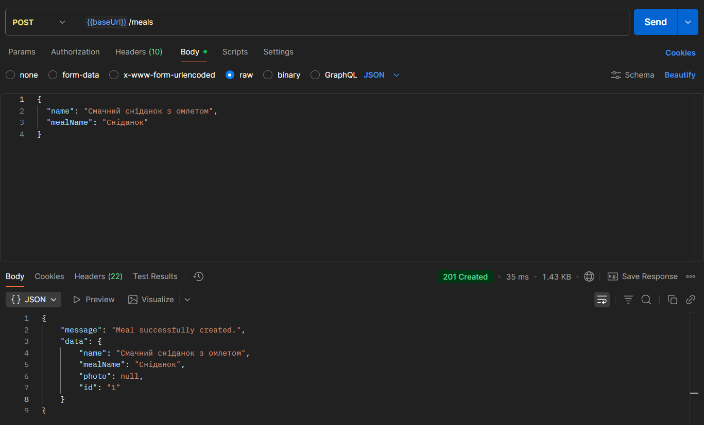

GET /v1/meals

GET /v1/meals/:id

PATCH /v1/meals/:id
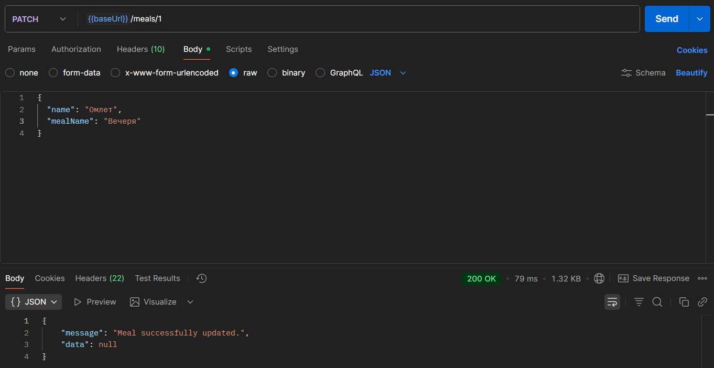

DELETE /v1/meals/:id

Recipes

POST /v1/recipes
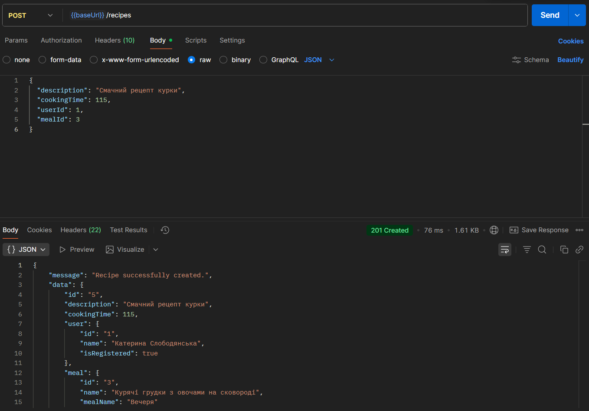

GET /v1/recipes
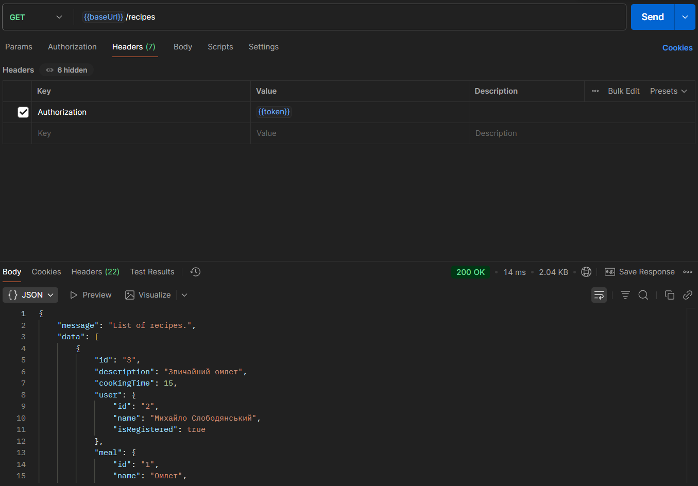

GET /v1/recipes/:id
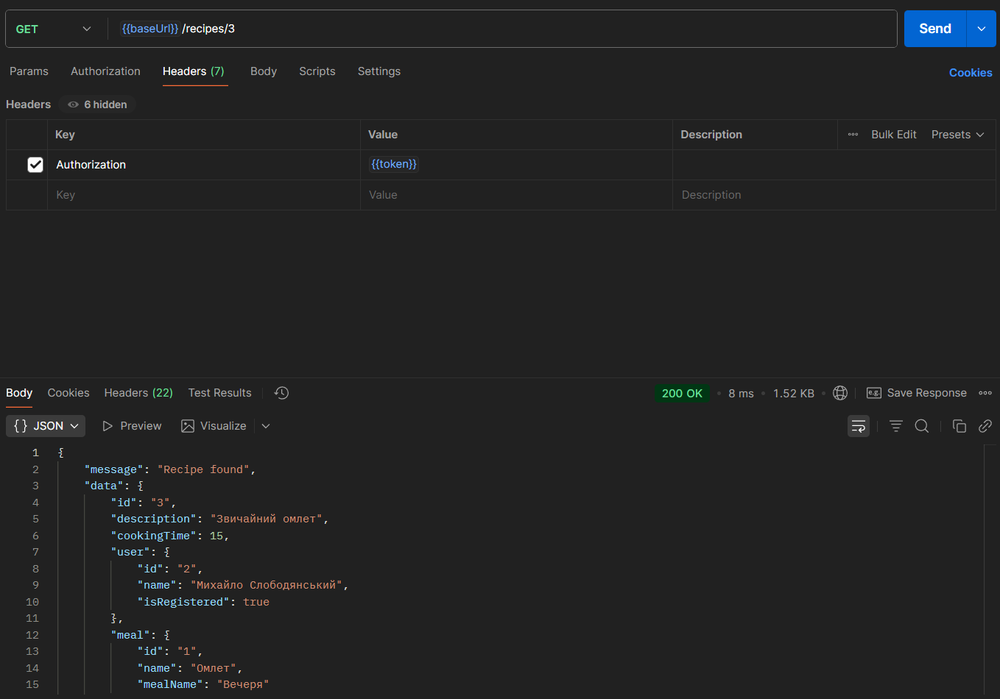

PATCH /v1/recipes/:id
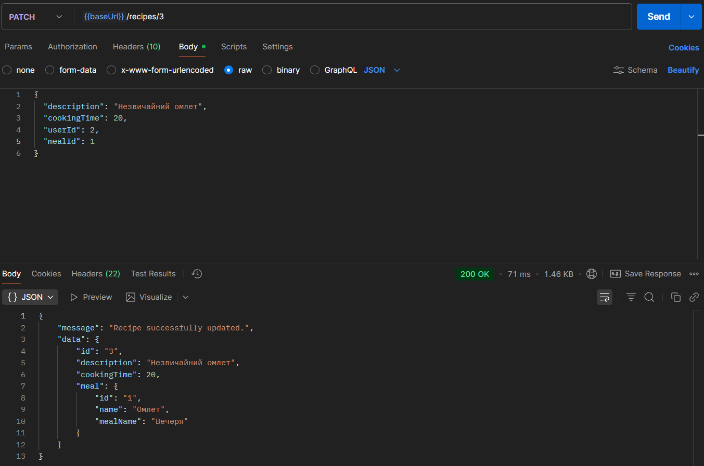

DELETE /v1/recipes/:id
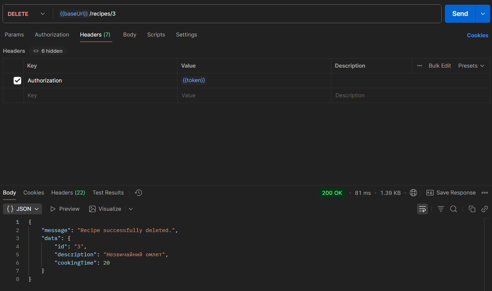

AppUser
POST /v1/app-users/:id
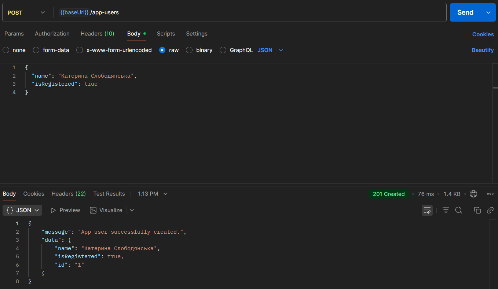

GET /v1/app-users/:id
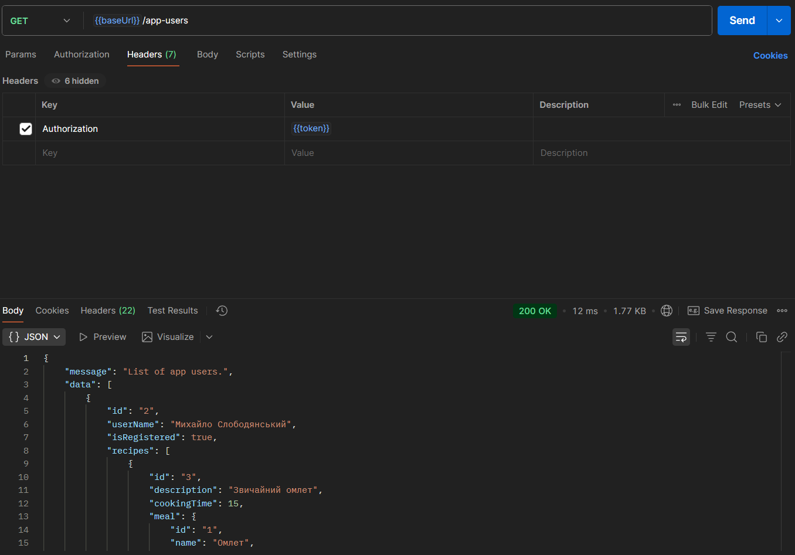

GET /v1/app-users/:id
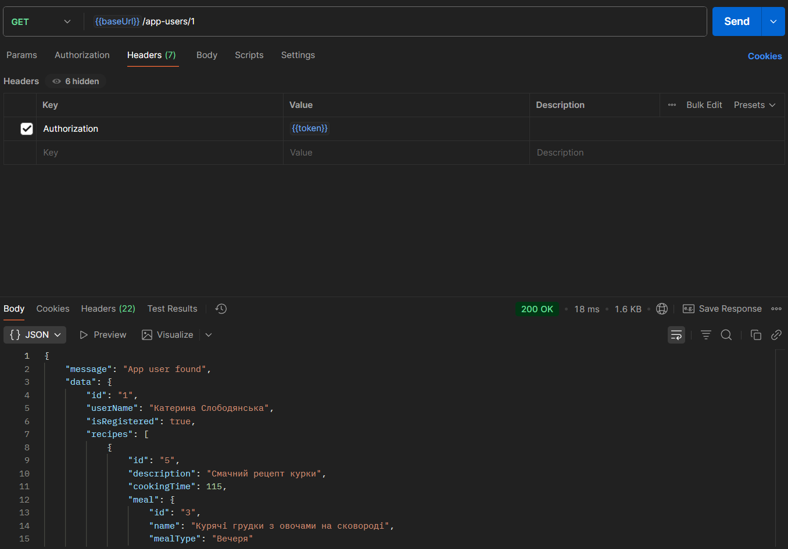

PATCH /v1/app-users/:id

DELETE /v1/app-users/:id
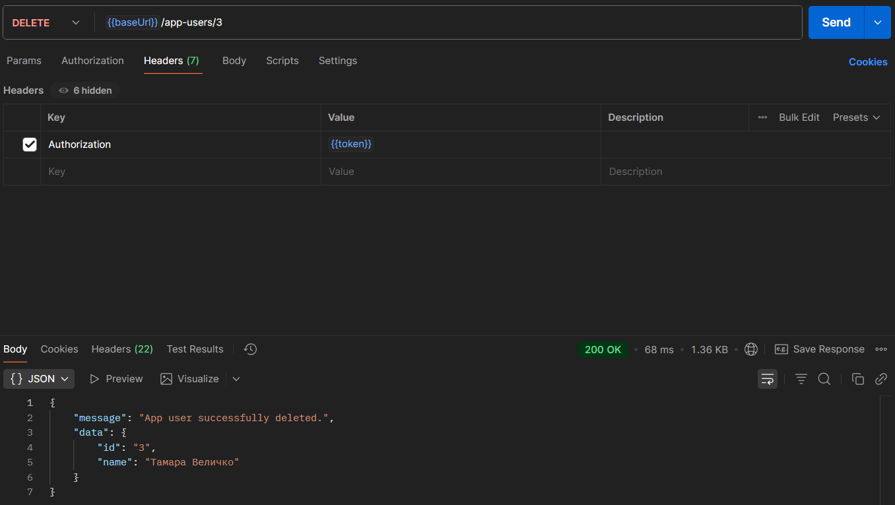

# Лабораторно-практична робота №6

## «Реалізація сервісного шару, DTO та валідації даних»

## Структура застосунку та принципи роботи шарів

### Middleware — перевірка вхідних даних

- Аналізує запити перед передачею далі по ланцюгу.
- Виявляє помилки у форматі чи структурі даних.
- Повертає код 400, якщо дані не проходять перевірку.

**Призначення:** забезпечує, щоб у контролер потрапляли лише валідні запити.

### Controller — взаємодія між клієнтом і системою

- Приймає перевірені дані.
- Викликає відповідні методи сервісного шару.
- Формує вихідні DTO для відповіді клієнту.

**Призначення:** організовує обмін між HTTP-запитами та бізнес-логікою.

- Service — основна логіка застосунку
- Виконує операції, що стосуються правил домену.
- Працює із репозиторієм, не залежачи від контролера.
- Реалізує CRUD-операції та бізнес-процеси.

**Призначення:** містить усю логіку, яка визначає поведінку системи.

### Repository — робота з базою даних

- Забезпечує взаємодію з ORM та таблицями БД.
- Не містить бізнес-логіки чи HTTP-залежностей.
- Використовується сервісом як джерело даних.

**Призначення:** централізований шар для операцій з базою даних.

## Приклади коду
### Middleware
